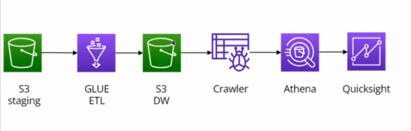
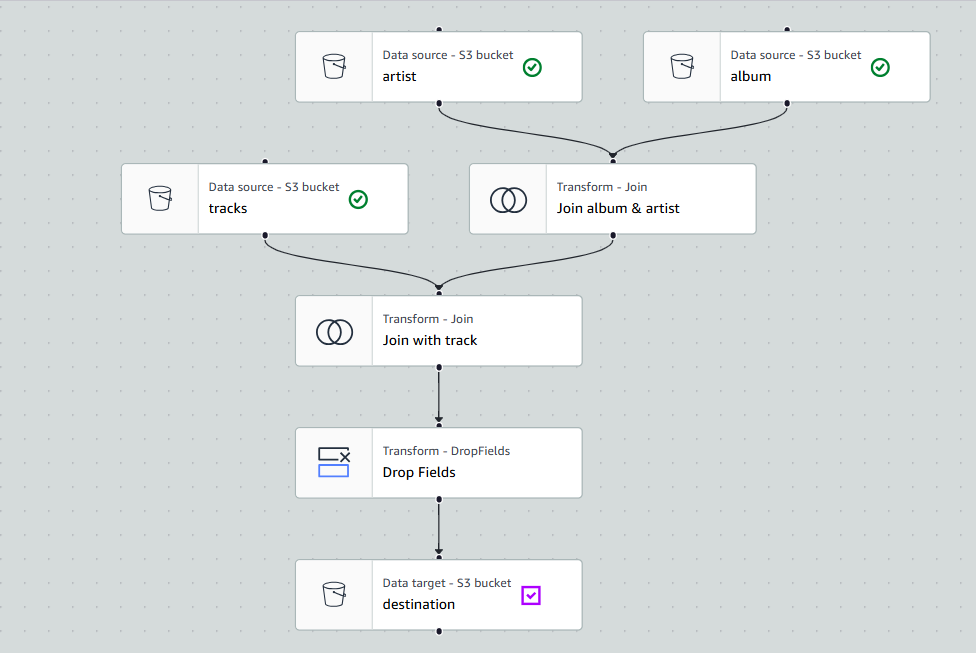

# Spotify AWS Glue ETL Pipeline (Visual + PySpark)

## Overview
This project builds an AWS data pipeline using **S3 + AWS Glue Studio (Visual ETL) + Glue Data Catalog Crawler + Athena + QuickSight**.

### What it does
- Reads raw CSV datasets from **S3 staging**
- Performs joins:
  - **Artist ↔ Album** (artist.id = album.artist_id)
  - Join result ↔ **Track** (track.track_id = album.track_id)
- Drops unnecessary columns
- Writes curated output as **Parquet (Snappy)** to **S3 datawarehouse**
- Runs **basic data quality rule** (ColumnCount > 0)
- Makes the data queryable via **Crawler + Athena**, and visualizable in **QuickSight**

## Architecture

## Glue Studio Visual Job

## Tech Stack
- AWS S3 (staging + data warehouse)
- AWS Glue Studio (Visual ETL) + PySpark
- AWS Glue Data Catalog + Crawler
- Amazon Athena
- Amazon QuickSight

## Input Data (S3 Staging)
- artists.csv
- albums.csv
- track.csv

## Output (S3 Data Warehouse)
- Parquet (snappy) curated dataset

## How to Run
1. Upload input CSVs to your S3 staging bucket
2. Create an AWS Glue Job (Glue Studio Visual)
3. Attach an IAM role with permissions for S3, Glue, Logs, and Athena
4. Run the job
5. Run Glue Crawler on the datawarehouse S3 path
6. Query in Athena
7. Build dashboard in QuickSight

## Code
- PySpark Glue script: `src/glue_job.py`
- Visual job JSON: `src/glue_visual_job.json`

